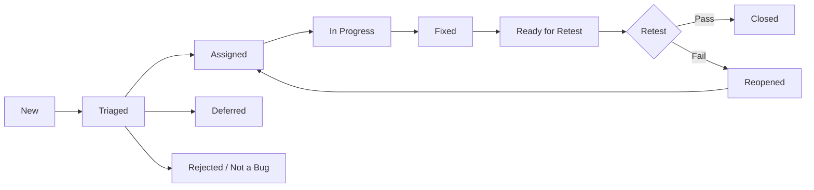
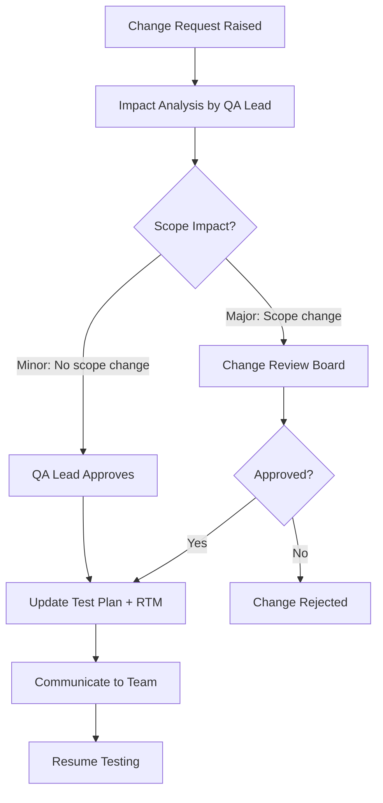

# Test Plan: VWO Login Dashboard (app.vwo.com)

---

## 1. Document Control

| Field | Details |
|---|---|
| **Document Title** | Test Plan – VWO Login Dashboard |
| **Application URL** | [https://app.vwo.com](https://app.vwo.com) |
| **Version** | 1.0 |
| **Status** | Draft |
| **Created Date** | 2026-06-24 |
| **Last Updated** | 2026-06-24 |
| **Prepared By** | QA Lead |
| **Reviewed By** | _Pending_ |
| **Approved By** | _Pending_ |

### Revision History

| Version | Date | Author | Change Description |
|---|---|---|---|
| 1.0 | 2026-06-24 | QA Lead | Initial draft of the comprehensive test plan |

---

## 2. Purpose

The purpose of this Test Plan is to define the testing strategy, scope, approach, resources, schedule, and deliverables required to validate the VWO Login Dashboard at **app.vwo.com**. This document ensures that all functional and non-functional requirements outlined in the Product Requirements Document (PRD) are systematically verified before release.

This test plan aims to:

- Establish a structured approach to test the login dashboard's authentication system, user experience, security, performance, and accessibility features.
- Ensure alignment between the PRD requirements and the delivered product.
- Define clear entry/exit criteria, roles, risks, and mitigation strategies.
- Serve as a single reference document for all stakeholders involved in the quality assurance process.

---

## 3. Project / Product Overview

**VWO (Visual Website Optimizer)** is a leading digital experience optimization platform used by over 4,000 brands across 90 countries. The platform provides A/B testing, conversion rate optimization, and user behavior analysis capabilities.

The **Login Dashboard** at `app.vwo.com` serves as the critical entry point for all users accessing VWO's suite of experimentation, personalization, and analytics tools.

**Target Users:**

| User Segment | Description |
|---|---|
| **Primary Users** | Digital marketers, product managers, UX designers, and developers at growing businesses |
| **Secondary Users** | Enterprise teams, conversion rate optimization specialists, and data analysts |
| **User Base Scale** | Companies ranging from 50–200 employees to large enterprises with 1,000+ employees |

**Key Business Objectives (from PRD):**

- Ensure secure access to VWO's experimentation platform.
- Minimize login friction to improve user adoption and retention.
- Support enterprise security requirements and compliance standards.
- Facilitate seamless onboarding for new users discovering VWO's capabilities.

---

## 4. Test Objectives

The test objectives for the VWO Login Dashboard are:

1. **Functional Correctness:** Verify that all authentication workflows (login, registration, password reset, SSO, MFA) function as specified in the PRD.
2. **Security Validation:** Confirm that data protection mechanisms (encryption, secure storage, HTTPS, rate limiting) meet enterprise-grade security standards.
3. **Performance Benchmarking:** Validate that the login page loads within 2 seconds and supports thousands of concurrent login attempts with 99.9% uptime.
4. **User Experience:** Ensure the interface is responsive, intuitive, and supports Light/Dark Mode, auto-focus, clickable labels, and loading states.
5. **Accessibility Compliance:** Verify WCAG 2.1 AA compliance including screen reader support, high contrast mode, and full keyboard navigation.
6. **Integration Verification:** Validate seamless transitions to the VWO core platform, SSO/OAuth/SAML protocols, and third-party identity providers.
7. **Compliance Adherence:** Ensure GDPR, CCPA, and OWASP authentication guideline compliance.
8. **Cross-Browser/Device Compatibility:** Confirm consistent behavior across browsers, operating systems, and device types.

---

## 5. Scope

### 5.1 In Scope

The following areas are within the scope of this test plan, derived directly from the PRD:

| # | Test Area | PRD Reference |
|---|---|---|
| 1 | Primary Authentication – Email/password login with secure validation | Authentication System |
| 2 | Session Management – Secure session handling with configurable timeouts | Authentication System |
| 3 | Multi-Factor Authentication (MFA) – Optional 2FA support | Authentication System |
| 4 | Single Sign-On (SSO) – Enterprise SSO via SAML, OAuth | Authentication System / Integration |
| 5 | User Input Validation – Real-time validation, email format, password strength | User Input Validation |
| 6 | Password Management – Forgot password, reset flow, recovery options, complexity rules | Password Management |
| 7 | Remember Me Functionality – Persistent login sessions | Existing Features |
| 8 | Registration/Free Trial Signup – Account registration link and onboarding path | Existing Features / User Journey |
| 9 | Responsive Design – Mobile-optimized, touch-friendly controls | Interface Design |
| 10 | Accessibility – Screen reader, high contrast, keyboard navigation (WCAG 2.1 AA) | Accessibility Features |
| 11 | Light and Dark Mode – Theme switching | Branding and Visual Design |
| 12 | Error Handling and Recovery – Clear error messages, recovery options | Error Recovery Flow |
| 13 | Loading States – Feedback during authentication processing | Interface Design |
| 14 | Security – Encryption, HTTPS, rate limiting, brute force protection | Security Specifications |
| 15 | Performance – Page load under 2 seconds, CDN, asset optimization | Performance Requirements |
| 16 | Scalability – Concurrent users, high availability (99.9%), multi-region | Scalability |
| 17 | Platform Integration – Transition to main VWO dashboard post-login | Integration Requirements |
| 18 | Analytics Integration – Login success/failure tracking | Integration Requirements |
| 19 | Social Login – Google, Microsoft identity providers | Third-Party Services |
| 20 | Compliance – GDPR, CCPA, OWASP | Compliance and Standards |
| 21 | Product Announcements Banner – New UI launch banner | Existing Features |

### 5.2 Out of Scope

The following items are explicitly **out of scope** for this test plan:

| # | Item | Reason |
|---|---|---|
| 1 | VWO Core Platform features (A/B testing, heatmaps, session recordings) | Post-login platform functionality; covered by separate test plans |
| 2 | Biometric Authentication (fingerprint, facial recognition) | Listed as future enhancement in PRD |
| 3 | Adaptive Authentication (risk-based) | Listed as future enhancement in PRD |
| 4 | Progressive Web App (PWA) capabilities | Listed as future enhancement in PRD |
| 5 | A/B Testing of the login page itself | Listed as future analytics/optimization enhancement |
| 6 | Backend infrastructure setup and DevOps | Infrastructure team responsibility |
| 7 | Third-party service internal testing (Google OAuth, Microsoft SSO internals) | Vendor responsibility; only integration points are tested |
| 8 | Marketing website (vwo.com) pages outside the login dashboard | Not part of this product scope |

---

## 6. Assumptions

| # | Assumption |
|---|---|
| 1 | The PRD (Version shared) is the approved and finalized set of requirements for this release. |
| 2 | A stable test environment mirroring production will be available before test execution begins. |
| 3 | Test data (valid/invalid user credentials, enterprise SSO configurations) will be provisioned by the DevOps/engineering team. |
| 4 | Third-party SSO/OAuth/SAML sandbox environments (Google, Microsoft) will be available for integration testing. |
| 5 | VWO design system guidelines, style guide, and branding assets are accessible for UI validation. |
| 6 | The login dashboard will be deployed on HTTPS with valid SSL/TLS certificates in all test environments. |
| 7 | CDN and multi-region infrastructure will be configured in the staging environment to allow performance testing. |
| 8 | Accessibility testing tools (e.g., Axe, NVDA, VoiceOver) are licensed and available to the QA team. |
| 9 | The development team follows a CI/CD pipeline, and builds are deployable to the test environment on demand. |
| 10 | GDPR/CCPA compliance requirements are documented and reviewed by the legal/compliance team. |

---

## 7. Dependencies

| # | Dependency | Owner | Impact if Unavailable |
|---|---|---|---|
| 1 | Stable test environment (staging) with production-like configuration | DevOps | Test execution cannot begin |
| 2 | Test user accounts with various roles and subscription plans | Engineering/DevOps | Authentication and role-based tests blocked |
| 3 | Enterprise SSO sandbox (SAML/OAuth configured IdP) | Engineering/IT | SSO integration testing blocked |
| 4 | Google and Microsoft OAuth test app credentials | Engineering | Social login testing blocked |
| 5 | VWO API documentation for login/session endpoints | Engineering | API and integration testing blocked |
| 6 | SSL/TLS certificates and HTTPS enforcement on test environment | DevOps/Security | Security testing incomplete |
| 7 | CDN and load balancer configuration in staging | DevOps | Performance and scalability testing inaccurate |
| 8 | Accessibility testing tools and screen readers | QA Lead | WCAG compliance testing blocked |
| 9 | Performance testing tools (e.g., JMeter, k6) setup and licensing | QA Lead | Performance benchmarking blocked |
| 10 | Design mockups and brand guidelines for UI validation | Product/Design | UI/Visual testing delayed |
| 11 | Completed development of all Phase 1, 2, and 3 features per PRD | Engineering | Feature-level testing blocked |
| 12 | Bug tracking and test management tool access (e.g., JIRA, Zephyr) | QA Lead | Defect tracking and reporting impacted |

---

## 8. Test Items

The following test items are derived from the PRD's functional and technical requirements:

| Test Item ID | Test Item | PRD Section |
|---|---|---|
| TI-001 | Login Page UI – Layout, branding, VWO logo, visual design | Interface Design / Branding |
| TI-002 | Email Input Field – Format validation, auto-focus, mobile keyboard | User Input Validation |
| TI-003 | Password Input Field – Strength indicator, masking, complexity rules | User Input Validation / Password Management |
| TI-004 | Login Button – Authentication submission, loading state | Authentication System |
| TI-005 | Remember Me Checkbox – Persistent session behavior | Existing Features |
| TI-006 | Forgot Password Link & Reset Flow – Token generation, email delivery, reset page | Password Management |
| TI-007 | Account Registration / Free Trial Link – Navigation to signup | Existing Features / User Journey |
| TI-008 | Multi-Factor Authentication (MFA/2FA) – Setup, validation, bypass handling | Authentication System |
| TI-009 | Single Sign-On (SSO) – SAML, OAuth flows | Authentication System / Integration |
| TI-010 | Social Login – Google, Microsoft identity provider integration | Third-Party Services |
| TI-011 | Error Messages – Invalid credentials, locked accounts, network errors | Error Recovery Flow |
| TI-012 | Session Management – Token generation, timeout, secure cookie handling | Authentication System / Security |
| TI-013 | Light and Dark Mode – Theme toggle, persistence, visual consistency | Branding and Visual Design |
| TI-014 | Responsive Design – Mobile, tablet, desktop layouts | Interface Design |
| TI-015 | Accessibility Features – ARIA labels, keyboard nav, high contrast, screen reader | Accessibility Features |
| TI-016 | Product Announcement Banner – Display, dismiss, link behavior | Existing Features |
| TI-017 | HTTPS / Encryption – TLS enforcement, data transmission security | Security Specifications |
| TI-018 | Rate Limiting / Brute Force Protection – Throttling after failed attempts | Security Specifications |
| TI-019 | Page Load Performance – Sub-2-second loading, asset optimization, CDN | Performance Requirements |
| TI-020 | Concurrent User Load – Thousands of simultaneous logins | Scalability |
| TI-021 | Post-Login Dashboard Redirect – Seamless transition to VWO main dashboard | Integration / User Journey |
| TI-022 | Analytics Integration – Login success/failure event tracking | Integration Requirements |
| TI-023 | GDPR/CCPA Compliance – Data handling, consent, privacy controls | Compliance and Standards |
| TI-024 | OWASP Compliance – Authentication guideline adherence | Compliance and Standards |
| TI-025 | Clickable Labels – Enhanced form label accessibility | Interface Design |

---

## 9. Requirements Traceability Approach

A **Requirements Traceability Matrix (RTM)** will be maintained to ensure bi-directional traceability between:

- **PRD Requirements → Test Cases → Test Results → Defects**

### Traceability Structure

```
PRD Requirement ID ←→ Test Item ID ←→ Test Case ID(s) ←→ Execution Result ←→ Defect ID(s)
```

### RTM Process

| Step | Activity | Tool |
|---|---|---|
| 1 | Map each PRD requirement to one or more Test Items (Section 8) | RTM Spreadsheet / Test Management Tool |
| 2 | Create test cases linked to Test Items | JIRA / Zephyr / TestRail |
| 3 | During execution, record pass/fail results against each test case | Test Management Tool |
| 4 | Link defects raised during execution back to the failing test case and PRD requirement | JIRA |
| 5 | Generate traceability reports for stakeholder review and sign-off | Test Management Tool |

### Coverage Metrics

- **Forward Traceability:** Every PRD requirement must have at least one corresponding test case.
- **Backward Traceability:** Every test case must trace back to a PRD requirement.
- **Coverage Target:** 100% requirement coverage before exit criteria is met.

---

## 10. Test Strategy / Test Approach

### 10.1 Overall Approach

The testing strategy follows a **risk-based, shift-left approach** aligned with industry QA standards for enterprise SaaS platforms. Testing will be executed in phases corresponding to the PRD's implementation phases:

| Phase | PRD Development Phase | Testing Focus |
|---|---|---|
| Phase 1 | Core Authentication | Login form, validation, error handling, password reset |
| Phase 2 | Enhanced UX | Responsive design, accessibility, advanced validation, themes |
| Phase 3 | Enterprise Features | SSO, MFA, analytics integration, monitoring |

**Testing Pyramid:**

```
            /  Exploratory / E2E  \         ← Fewer, high-value
           /   Integration Tests   \
          /   API / Service Tests    \
         /    Unit Tests (Dev)        \     ← Many, fast
```

- **Unit Tests:** Owned by the development team; QA reviews coverage.
- **API/Service Tests:** QA-authored; validate authentication endpoints, session management, and error responses.
- **Integration Tests:** QA-authored; verify SSO, OAuth, social login, and post-login dashboard transitions.
- **E2E / Exploratory:** QA-authored; cover end-to-end user journeys, edge cases, and usability.

### 10.2 Test Levels

| Test Level | Description | Owner |
|---|---|---|
| **Unit Testing** | Individual component-level testing (form fields, validators, UI components) | Development Team |
| **Integration Testing** | Interactions between login module and SSO/OAuth providers, VWO dashboard, analytics | QA Team |
| **System Testing** | End-to-end login workflows across all user journeys (new user, returning user, error recovery) | QA Team |
| **User Acceptance Testing (UAT)** | Validation by product owners and selected stakeholders against business requirements | Product Team / Stakeholders |

### 10.3 Functional Testing

Functional testing will validate all features specified in the PRD against expected behavior.

**Key Functional Test Areas:**

| Area | Test Scenarios (from PRD) |
|---|---|
| **Email/Password Login** | Valid credentials → successful login; Invalid email format → real-time validation error; Wrong password → clear error message; Empty fields → validation messages |
| **Password Management** | Forgot password link → reset email sent; Valid reset token → password reset page; Expired token → error message; New password → complexity rules enforced; Successful reset → confirmation message |
| **Remember Me** | Checkbox checked → session persists after browser close; Checkbox unchecked → session ends on close |
| **MFA/2FA** | Enable 2FA → setup flow; Login with 2FA → code prompt; Valid code → access granted; Invalid code → error; Recovery flow |
| **SSO (SAML/OAuth)** | Enterprise SSO login → redirect to IdP; Successful IdP auth → redirect back and access VWO dashboard; SSO misconfiguration → clear error |
| **Social Login** | Google login → OAuth consent → access granted; Microsoft login → OAuth consent → access granted; Cancelled consent → return to login |
| **Registration Link** | Click "Start free trial" → navigate to registration page; Registration flow → guided onboarding |
| **Theme Toggle** | Switch to Dark Mode → all elements render correctly; Switch to Light Mode → all elements render correctly; Theme preference persists |
| **Product Banner** | Banner displays new UI announcement; Banner link navigates correctly; Banner dismissal (if applicable) |
| **Post-Login Redirect** | Successful login → redirect to personalized VWO dashboard; Context/session preservation from previous sessions |

### 10.4 Integration Testing

Integration testing validates the login dashboard's interactions with external systems and the VWO core platform.

| Integration Point | Test Focus |
|---|---|
| **VWO Core Platform** | Verify seamless transition from login to main dashboard; validate session token is carried forward; verify user context (role, permissions) is loaded correctly |
| **SSO / SAML Provider** | Validate SAML assertion handling; test SP-initiated and IdP-initiated flows; verify attribute mapping (email, name, role) |
| **OAuth Provider (Google, Microsoft)** | Validate OAuth 2.0 authorization code flow; test token exchange; handle expired/revoked tokens gracefully |
| **Analytics Platform** | Verify login success events are tracked; verify login failure events are tracked; validate event payload accuracy |
| **Customer Support System** | Verify support link/integration from login page for login assistance |
| **Email Service** | Validate password reset emails are delivered; verify reset token links work correctly; test email deliverability |
| **CDN** | Validate that static assets (CSS, JS, images) are served via CDN; verify cache behavior |

### 10.5 Regression Testing

Regression testing ensures that new changes do not break existing functionality.

**Regression Strategy:**

- **Trigger:** Every code change, bug fix, or configuration update deployed to the test environment.
- **Scope:** A prioritized regression suite covering core login flows, critical error handling, and integration points.
- **Automation:** The regression suite will be automated (see Section 10.9) for inclusion in the CI/CD pipeline.

**Regression Suite Priorities:**

| Priority | Scenarios |
|---|---|
| **P1 – Critical** | Email/password login, password reset, post-login redirect, HTTPS enforcement, session management |
| **P2 – High** | MFA, SSO, social login, remember me, error messages |
| **P3 – Medium** | Theme toggle, responsive design, product banner, accessibility basics |
| **P4 – Low** | Edge-case validations, advanced keyboard navigation, analytics event payloads |

### 10.6 Exploratory Testing

Exploratory testing will be conducted to uncover defects not covered by scripted test cases, focusing on usability, edge cases, and real-world usage patterns.

**Exploratory Test Charters:**

| Charter | Focus Area | Time-Box |
|---|---|---|
| Charter 1 | Explore login form behavior under unusual input conditions (special characters, extremely long inputs, copy-paste, autofill) | 2 hours |
| Charter 2 | Explore error recovery flows – network interruption during login, server timeout, concurrent session conflicts | 2 hours |
| Charter 3 | Explore mobile login experience – various screen sizes, orientations, touch interactions, mobile keyboards | 2 hours |
| Charter 4 | Explore accessibility with screen readers (NVDA/VoiceOver) and keyboard-only navigation across all interactive elements | 2 hours |
| Charter 5 | Explore SSO/OAuth edge cases – expired tokens, revoked access, misconfigured IdP, back-button behavior | 2 hours |
| Charter 6 | Explore Dark Mode rendering – all UI elements, error states, loading states, contrast ratios | 1 hour |
| Charter 7 | Explore brute force/rate limiting behavior – rapid login attempts, account lockout, recovery process | 1 hour |

### 10.7 Non-Functional Testing

Non-functional testing covers performance, security, accessibility, and compatibility as specified in the PRD.

| Test Type | Objective | PRD Requirement |
|---|---|---|
| **Performance Testing** | Validate login page loads within 2 seconds; asset optimization (compressed images, minified CSS/JS); CDN integration | Performance Requirements |
| **Load Testing** | Validate support for thousands of concurrent login attempts without degradation | Scalability |
| **Stress Testing** | Determine system breaking points and graceful degradation behavior | Scalability |
| **Security Testing** | Validate encryption (TLS), secure storage (hashed passwords), rate limiting, brute force protection, OWASP compliance | Security Specifications |
| **Penetration Testing** | Identify vulnerabilities in authentication flow (SQL injection, XSS, CSRF, session hijacking) | Security Specifications |
| **Accessibility Testing** | Validate WCAG 2.1 AA compliance: ARIA labels, keyboard navigation, high contrast, screen reader compatibility | Accessibility Features |
| **Compatibility Testing** | Validate cross-browser (Chrome, Firefox, Safari, Edge) and cross-device (desktop, tablet, mobile) compatibility | Responsive Design |
| **Usability Testing** | Validate intuitive UX: auto-focus, clickable labels, loading states, clear error messages | Interface Design |
| **Reliability Testing** | Validate 99.9% uptime target under sustained load | Scalability |

### 10.8 Data Validation

| Validation Area | Test Focus |
|---|---|
| **Email Field** | Valid email formats (user@domain.com); invalid formats (missing @, spaces, special chars); boundary lengths |
| **Password Field** | Compliance with password complexity rules; minimum/maximum length; special characters; empty password handling |
| **Session Tokens** | Token uniqueness; token expiration; token integrity (tampering detection) |
| **Password Reset Tokens** | Token generation security; expiration enforcement; single-use validation |
| **User Data (GDPR)** | Personal data is encrypted in transit and at rest; data minimization principles; user consent captured |
| **SSO Assertions** | SAML assertion signature validation; attribute mapping accuracy; assertion expiration handling |

### 10.9 Automation Strategy

**Automation Scope:**

| Layer | Tool(s) | Scope |
|---|---|---|
| **UI E2E Tests** | Selenium / Cypress / Playwright | Core login flows, registration redirect, theme toggle, responsive checks |
| **API Tests** | Postman / RestAssured / k6 | Authentication endpoints, session management APIs, password reset APIs |
| **Performance Tests** | JMeter / k6 / Locust | Page load benchmarks, concurrent user load, stress tests |
| **Security Scans** | OWASP ZAP / Burp Suite | Automated vulnerability scanning of login endpoints |
| **Accessibility Scans** | Axe-core / Pa11y | Automated WCAG 2.1 AA checks on login page |
| **Visual Regression** | Percy / BackstopJS | Screenshot comparison for Light/Dark Mode, responsive layouts |

**Automation Priorities:**

1. **Phase 1:** Automate P1 regression suite (login, password reset, post-login redirect).
2. **Phase 2:** Automate P2 regression suite (MFA, SSO, social login) + API tests.
3. **Phase 3:** Automate performance benchmarks, security scans, and accessibility scans.

**CI/CD Integration:**

- Automated regression suite runs on every build deployed to staging.
- Security and accessibility scans run nightly.
- Performance benchmarks run weekly or before major releases.

---

## 11. Test Types and Coverage Matrix

| Test Type | TI-001 UI | TI-002 Email | TI-003 Password | TI-004 Login | TI-005 Remember | TI-006 Forgot Pwd | TI-007 Registration | TI-008 MFA | TI-009 SSO | TI-010 Social | TI-011 Errors | TI-012 Session | TI-013 Theme | TI-014 Responsive | TI-015 Accessibility | TI-016 Banner | TI-017 HTTPS | TI-018 Rate Limit | TI-019 Perf | TI-020 Load | TI-021 Redirect | TI-022 Analytics | TI-023 GDPR | TI-024 OWASP |
|---|---|---|---|---|---|---|---|---|---|---|---|---|---|---|---|---|---|---|---|---|---|---|---|---|
| **Functional** | ✓ | ✓ | ✓ | ✓ | ✓ | ✓ | ✓ | ✓ | ✓ | ✓ | ✓ | ✓ | ✓ | — | — | ✓ | — | — | — | — | ✓ | ✓ | — | — |
| **Integration** | — | — | — | — | — | ✓ | ✓ | ✓ | ✓ | ✓ | — | ✓ | — | — | — | — | — | — | — | — | ✓ | ✓ | — | — |
| **Regression** | ✓ | ✓ | ✓ | ✓ | ✓ | ✓ | — | ✓ | ✓ | ✓ | ✓ | ✓ | ✓ | ✓ | ✓ | — | ✓ | ✓ | — | — | ✓ | — | — | — |
| **Security** | — | — | ✓ | ✓ | — | ✓ | — | ✓ | ✓ | ✓ | — | ✓ | — | — | — | — | ✓ | ✓ | — | — | — | — | ✓ | ✓ |
| **Performance** | — | — | — | ✓ | — | — | — | — | — | — | — | — | — | — | — | — | — | — | ✓ | ✓ | ✓ | — | — | — |
| **Accessibility** | ✓ | ✓ | ✓ | ✓ | ✓ | ✓ | ✓ | — | — | — | ✓ | — | ✓ | ✓ | ✓ | ✓ | — | — | — | — | — | — | — | — |
| **Compatibility** | ✓ | ✓ | ✓ | ✓ | ✓ | ✓ | ✓ | ✓ | ✓ | ✓ | ✓ | — | ✓ | ✓ | — | ✓ | — | — | — | — | ✓ | — | — | — |
| **Exploratory** | ✓ | ✓ | ✓ | ✓ | — | ✓ | — | ✓ | ✓ | — | ✓ | ✓ | ✓ | ✓ | ✓ | — | — | ✓ | — | — | — | — | — | — |

---

## 12. Test Environment Strategy

### Environment Configuration

| Environment | Purpose | Configuration |
|---|---|---|
| **Development (DEV)** | Developer testing, unit tests, early integration | Local/dev servers; mock SSO/OAuth; test database |
| **QA / Staging** | Functional, integration, regression, exploratory testing | Production-like infrastructure; configured SSO sandbox; CDN enabled; HTTPS enforced |
| **Performance** | Load, stress, and scalability testing | Isolated environment mirroring production capacity; load balancers; multi-region CDN |
| **Security** | Penetration testing, vulnerability scanning | Isolated environment; no production data; OWASP ZAP/Burp Suite configured |
| **UAT** | User acceptance testing by stakeholders | Production-like; seeded with representative user data; full SSO integration |
| **Production** | Live environment | Monitored; smoke tests post-deployment only |

### Browser and Device Matrix

| Browser | Versions | OS |
|---|---|---|
| Google Chrome | Latest, Latest-1 | Windows 10/11, macOS, Android, iOS |
| Mozilla Firefox | Latest, Latest-1 | Windows 10/11, macOS |
| Apple Safari | Latest, Latest-1 | macOS, iOS |
| Microsoft Edge | Latest, Latest-1 | Windows 10/11 |

| Device Type | Specific Devices |
|---|---|
| Desktop | 1920×1080, 1366×768, 1440×900 |
| Tablet | iPad (Portrait & Landscape), Android Tablet |
| Mobile | iPhone 14/15, Samsung Galaxy S23/S24, Pixel 7/8 |

### Environment Access

- VPN access required for QA/Staging environments.
- Role-based access control for each environment.
- Separate database instances per environment to prevent data contamination.

---

## 13. Test Data Management

### Test Data Categories

| Category | Data Description | Source |
|---|---|---|
| **Valid User Accounts** | Registered users with valid email/password combinations across different subscription plans | Seeded in test DB |
| **Invalid Credentials** | Non-existent emails, incorrect passwords, expired accounts | Created by QA |
| **Enterprise SSO Accounts** | Users configured in sandbox IdP (SAML/OAuth) for SSO testing | IT/Engineering provisioned |
| **Social Login Accounts** | Google and Microsoft test accounts for OAuth integration testing | QA-created test accounts |
| **MFA-Enabled Accounts** | Users with 2FA enabled using authenticator app or SMS | QA-configured |
| **Locked/Suspended Accounts** | Accounts that have been locked due to failed attempts or admin suspension | QA/Admin-configured |
| **Password Reset Data** | Email addresses with pending reset tokens, expired tokens, used tokens | Generated during test execution |
| **Edge Case Data** | Emails with special characters, extremely long passwords, Unicode characters | Created by QA |

### Data Management Rules

1. **No Production Data:** Test environments will never use real production user data.
2. **Data Refresh:** Test data will be refreshed before each regression cycle.
3. **Data Isolation:** Each tester operates with their own dedicated set of test accounts.
4. **GDPR Compliance:** All test data handling follows GDPR data minimization principles.
5. **Sensitive Data Masking:** Passwords and personal information are masked in test reports and logs.

---

## 14. Roles and Responsibilities

| Role | Name | Responsibilities |
|---|---|---|
| **QA Lead / Test Manager** | _TBD_ | Test planning, strategy, resource allocation, stakeholder communication, risk management, sign-off |
| **Senior Test Engineer** | _TBD_ | Test case design, functional/integration test execution, defect reporting, regression testing |
| **Automation Engineer** | _TBD_ | Automation framework setup, script development, CI/CD integration, maintenance |
| **Performance Test Engineer** | _TBD_ | Load/stress test design, execution, analysis, and reporting |
| **Security Test Engineer** | _TBD_ | Penetration testing, vulnerability scanning, OWASP compliance validation |
| **Accessibility Tester** | _TBD_ | WCAG 2.1 AA compliance testing, screen reader testing, keyboard navigation |
| **Product Owner** | _TBD_ | PRD clarification, UAT participation, feature prioritization, final sign-off |
| **Development Lead** | _TBD_ | Bug fix prioritization, technical clarification, unit test coverage |
| **DevOps Engineer** | _TBD_ | Environment setup, deployment, CI/CD pipeline, infrastructure support |
| **UI/UX Designer** | _TBD_ | Visual validation, design guideline review, accessibility design review |

---

## 15. Estimation / Effort Plan

### Effort Breakdown by Phase

| Phase | Activity | Effort (Person-Days) |
|---|---|---|
| **Phase 1: Core Authentication** | | |
| | Test case design (login, validation, password reset, errors) | 5 |
| | Test execution – Functional | 5 |
| | Test execution – API | 3 |
| | Automation – P1 regression suite | 5 |
| | Defect retesting | 3 |
| | **Phase 1 Subtotal** | **21** |
| **Phase 2: Enhanced UX** | | |
| | Test case design (responsive, accessibility, themes, advanced validation) | 4 |
| | Test execution – Functional | 4 |
| | Test execution – Accessibility (WCAG 2.1 AA) | 4 |
| | Test execution – Compatibility (browsers/devices) | 3 |
| | Automation – P2 regression + visual regression | 5 |
| | Defect retesting | 3 |
| | **Phase 2 Subtotal** | **23** |
| **Phase 3: Enterprise Features** | | |
| | Test case design (SSO, MFA, analytics, social login) | 5 |
| | Test execution – Integration (SSO/OAuth/SAML) | 5 |
| | Test execution – Security (penetration, OWASP) | 5 |
| | Test execution – Performance (load, stress) | 4 |
| | Automation – P3 regression + performance + security scans | 5 |
| | Defect retesting | 3 |
| | **Phase 3 Subtotal** | **27** |
| **Cross-Phase** | | |
| | Test plan creation and review | 3 |
| | RTM maintenance | 2 |
| | Exploratory testing (7 charters) | 5 |
| | Regression testing (3 cycles) | 6 |
| | UAT support | 3 |
| | Test closure and reporting | 2 |
| | **Cross-Phase Subtotal** | **21** |
| | **Total Estimated Effort** | **92 Person-Days** |

---

## 16. Schedule / Milestones

| Milestone | Target Date | Dependency |
|---|---|---|
| Test Plan Approval | Week 1 | PRD finalization |
| Test Environment Ready | Week 2 | DevOps environment setup |
| Test Case Design Complete (Phase 1) | Week 3 | Test Plan approval |
| Phase 1 Test Execution Start | Week 4 | Phase 1 code deployment to staging |
| Phase 1 Test Execution Complete | Week 5 | — |
| Test Case Design Complete (Phase 2) | Week 5 | — |
| Phase 2 Test Execution Start | Week 6 | Phase 2 code deployment to staging |
| Phase 2 Test Execution Complete | Week 7 | — |
| Test Case Design Complete (Phase 3) | Week 7 | — |
| Phase 3 Test Execution Start | Week 8 | Phase 3 code deployment to staging |
| Phase 3 Test Execution Complete | Week 10 | — |
| Performance & Security Testing | Week 9–10 | Performance/Security environments ready |
| Regression Cycle 1 (Full) | Week 10 | All phases complete |
| UAT Execution | Week 11 | Regression cycle passed |
| Regression Cycle 2 (Final) | Week 11 | UAT feedback incorporated |
| Test Closure & Sign-Off | Week 12 | All exit criteria met |
| Production Deployment | Week 12 | Approved sign-off |

---

## 17. Entry Criteria

| # | Criterion |
|---|---|
| 1 | PRD is reviewed, approved, and baselined. |
| 2 | Test Plan is reviewed and approved by stakeholders. |
| 3 | Test environment (staging) is set up, configured, and accessible. |
| 4 | Test data (user accounts, SSO configurations) is provisioned. |
| 5 | Build is deployed to the test environment and a smoke test passes. |
| 6 | All P1/critical defects from previous builds are resolved and verified. |
| 7 | Unit test coverage meets the agreed threshold (≥ 80%). |
| 8 | Test cases are reviewed, approved, and linked in the RTM. |
| 9 | Required tools (test management, automation, performance, security) are set up. |
| 10 | Development team confirms the build is "test-ready" (no known critical blockers). |

---

## 18. Exit Criteria

| # | Criterion |
|---|---|
| 1 | 100% of planned test cases have been executed. |
| 2 | 95% or higher test case pass rate achieved. |
| 3 | Zero open Severity 1 (Blocker) or Severity 2 (Critical) defects. |
| 4 | All Severity 3 (Major) defects have agreed mitigation plans or deferral approvals. |
| 5 | Requirements Traceability Matrix shows 100% requirement coverage. |
| 6 | Performance benchmarks met: login page load < 2 seconds; concurrent user support validated. |
| 7 | Security scan results reviewed: no high/critical vulnerabilities open. |
| 8 | Accessibility audit confirms WCAG 2.1 AA compliance. |
| 9 | Regression suite (automated) passes with 100% pass rate on the release candidate build. |
| 10 | UAT sign-off obtained from the Product Owner. |
| 11 | All test deliverables (reports, RTM, defect summary) are completed and shared. |

---

## 19. Suspension / Resumption Criteria

### Suspension Criteria

Testing will be suspended if any of the following conditions occur:

| # | Suspension Trigger |
|---|---|
| 1 | Test environment becomes unavailable or unstable for more than 4 hours. |
| 2 | A Severity 1 (Blocker) defect is found that prevents core login functionality. |
| 3 | More than 30% of test cases fail in a single test cycle, indicating build instability. |
| 4 | Critical third-party dependency (SSO provider, OAuth service) becomes unavailable. |
| 5 | A security vulnerability is discovered that requires immediate remediation. |
| 6 | Significant requirement changes are introduced mid-cycle requiring re-planning. |

### Resumption Criteria

Testing will resume when:

| # | Resumption Condition |
|---|---|
| 1 | Test environment is restored and stability is confirmed by DevOps. |
| 2 | Blocking defect is fixed, deployed, and verified in the test environment. |
| 3 | A new, stable build is deployed with root cause analysis of previous failures. |
| 4 | Third-party dependency is restored and connectivity is verified. |
| 5 | Security vulnerability is patched, verified, and cleared by the security team. |
| 6 | Updated requirements are documented, test plan is revised, and stakeholders approve re-start. |

---

## 20. Defect Management Process

### Defect Lifecycle



### Defect Reporting Guidelines

Each defect report must include:

| Field | Description |
|---|---|
| **Defect ID** | Auto-generated by the tracking tool |
| **Title** | Concise summary of the defect |
| **Module / Test Item** | Affected test item (e.g., TI-004 Login Button) |
| **Severity** | Blocker / Critical / Major / Minor / Trivial (see Section 21) |
| **Priority** | P1 / P2 / P3 / P4 (see Section 21) |
| **Environment** | Browser, OS, device, environment (e.g., Chrome 126, Windows 11, Staging) |
| **Steps to Reproduce** | Numbered steps to reproduce the issue |
| **Expected Result** | What should happen per PRD |
| **Actual Result** | What actually happened |
| **Attachments** | Screenshots, screen recordings, console logs, network traces |
| **PRD Requirement** | Link to the relevant PRD requirement |
| **Assigned To** | Developer responsible for the fix |

### Defect Triage

- **Frequency:** Daily defect triage meetings during active test execution.
- **Participants:** QA Lead, Development Lead, Product Owner.
- **Output:** Prioritized defect backlog, severity/priority agreements, deferral decisions.

---

## 21. Severity / Priority Definitions

### Severity Levels

| Severity | Definition | Examples (VWO Login Context) |
|---|---|---|
| **S1 – Blocker** | System is completely unusable; no workaround exists | Login form does not submit; HTTPS not enforced; login page does not load |
| **S2 – Critical** | Major feature is broken; significant impact on core functionality | Password reset email not sent; SSO redirect fails; session not created after login; MFA bypass possible |
| **S3 – Major** | Feature works but with significant issues; workaround available | Remember Me does not persist; Dark Mode renders incorrectly on some pages; error message is misleading |
| **S4 – Minor** | Minor issue with minimal impact on functionality | Clickable label area slightly smaller than expected; minor alignment issue on tablet |
| **S5 – Trivial** | Cosmetic issue with no functional impact | Typo in placeholder text; 1px misalignment; font weight variation |

### Priority Levels

| Priority | Definition | Response Time |
|---|---|---|
| **P1 – Urgent** | Must be fixed immediately; blocks testing or production | Fix within 24 hours |
| **P2 – High** | Must be fixed in the current sprint/cycle | Fix within 3 days |
| **P3 – Medium** | Should be fixed before release; can be scheduled | Fix within 1 week |
| **P4 – Low** | Can be deferred to a future release | Fix in next release |

---

## 22. Risks and Mitigation

| # | Risk | Likelihood | Impact | Mitigation Strategy |
|---|---|---|---|---|
| 1 | **Test environment instability** – Staging environment has downtime or configuration drift | Medium | High | Establish environment health checks; DevOps on-call support; maintain local mock environment as backup |
| 2 | **Third-party SSO/OAuth sandbox unavailability** – Google/Microsoft test environments down | Medium | High | Create mock SSO responses for functional testing; schedule integration tests during confirmed uptime windows |
| 3 | **Requirement changes mid-cycle** – PRD modifications during test execution | Medium | High | Formal change management process (Section 33); impact analysis before accommodating changes |
| 4 | **Resource unavailability** – QA team members unavailable due to unplanned leave | Low | Medium | Cross-training on all test areas; documented test cases enable handoff; maintain at least 2 testers trained on each module |
| 5 | **Performance environment limitations** – Unable to simulate production-level load | Medium | Medium | Use cloud-based load generation (AWS/Azure); extrapolate results with scaling models; coordinate with DevOps for capacity |
| 6 | **Security vulnerabilities discovered late** – Critical security issues found close to release | Low | High | Integrate automated security scans (OWASP ZAP) in CI/CD; conduct early security testing in Phase 1 |
| 7 | **Accessibility compliance gaps** – WCAG 2.1 AA issues found late in the cycle | Medium | Medium | Run automated accessibility scans (Axe) from Phase 1; involve accessibility tester early |
| 8 | **Browser compatibility issues** – Rendering differences across browsers | Medium | Medium | Start cross-browser testing in Phase 2; use visual regression tools (Percy/BackstopJS) |
| 9 | **Test data corruption** – Test data becomes invalid during long test cycles | Low | Medium | Automated data refresh scripts; database snapshots before each cycle; data isolation per tester |
| 10 | **Delayed development delivery** – Code not ready per schedule | Medium | High | Buffer time in schedule; parallel test design during development; prioritize testing of completed features |

---

## 23. Quality Gates / Release Gates

### Gate 1: Test Readiness Gate (Before Test Execution)

| Checkpoint | Criteria |
|---|---|
| Build Stability | Smoke test passes on staging deployment |
| Test Assets | Test cases reviewed, approved, and linked in RTM |
| Environment | Test environment verified and accessible |
| Data | Test data provisioned and validated |
| **Gate Decision** | Proceed / Delay with justification |

### Gate 2: Functional Completion Gate (After Functional Testing)

| Checkpoint | Criteria |
|---|---|
| Functional Coverage | 100% of functional test cases executed |
| Pass Rate | ≥ 90% functional test cases pass |
| Blockers | Zero S1/S2 defects open |
| **Gate Decision** | Proceed to NFR testing / Fix & Re-test |

### Gate 3: Release Readiness Gate (Before Production Deployment)

| Checkpoint | Criteria |
|---|---|
| Test Execution | 100% test cases executed; ≥ 95% pass rate |
| Defects | Zero S1/S2 open; S3 defects have mitigation plans |
| Performance | Login page < 2s load time; concurrent user targets met |
| Security | No high/critical vulnerabilities; OWASP compliance verified |
| Accessibility | WCAG 2.1 AA compliance confirmed |
| Regression | Automated regression suite 100% pass |
| UAT | Product Owner sign-off obtained |
| **Gate Decision** | Go / No-Go for production release |

---

## 24. Metrics and Reporting

### Key Metrics

| Metric | Formula | Target |
|---|---|---|
| **Test Case Pass Rate** | (Passed / Total Executed) × 100 | ≥ 95% |
| **Test Execution Progress** | (Executed / Total Planned) × 100 | 100% by exit |
| **Defect Density** | Total Defects / Number of Test Items | Trending downward per cycle |
| **Defect Leakage** | Defects found in UAT or Production / Total Defects | < 5% |
| **Defect Closure Rate** | (Closed Defects / Total Defects) × 100 | ≥ 90% by exit |
| **Automation Coverage** | (Automated Tests / Total Regression Tests) × 100 | ≥ 70% |
| **Requirements Coverage** | (Requirements with ≥ 1 Test Case / Total Requirements) × 100 | 100% |
| **Blocker/Critical Resolution Time** | Average time from report to fix for S1/S2 defects | < 48 hours |

### Reporting Cadence

| Report | Frequency | Audience | Content |
|---|---|---|---|
| **Daily Test Status** | Daily | QA Team, Dev Lead | Execution progress, new defects, blockers |
| **Weekly Test Summary** | Weekly | Project Manager, Product Owner, Stakeholders | Metrics dashboard, risk updates, milestone status |
| **Defect Triage Report** | Daily (during execution) | QA Lead, Dev Lead, Product Owner | New defects, prioritization decisions, pending fixes |
| **Phase Completion Report** | End of each phase | All Stakeholders | Phase summary, pass/fail rates, defect analysis, risks |
| **Final Test Report** | End of testing | All Stakeholders + Management | Comprehensive report with metrics, RTM, defect summary, recommendation |

---

## 25. Communication / Governance Plan

### Communication Matrix

| Communication | Channel | Frequency | Participants |
|---|---|---|---|
| **Daily Standup** | Video call (Zoom/Teams) | Daily | QA Team, Dev Lead |
| **Defect Triage** | Video call + JIRA board | Daily (during execution) | QA Lead, Dev Lead, Product Owner |
| **Weekly Status Review** | Video call + Status Report | Weekly | QA Lead, Project Manager, Product Owner, Dev Lead |
| **Phase Gate Review** | Formal meeting + Gate Report | End of each phase | All Stakeholders |
| **Escalation** | Email + Call | As needed | QA Lead → Project Manager → Director |
| **Ad-hoc Technical Discussion** | Slack/Teams channel | As needed | QA Team, Dev Team |
| **Release Go/No-Go Meeting** | Formal meeting | Before production deployment | QA Lead, Dev Lead, Product Owner, DevOps, Management |

### Escalation Path

```
Level 1: QA Engineer → QA Lead (within 4 hours)
Level 2: QA Lead → Project Manager (within 8 hours)
Level 3: Project Manager → Director / VP Engineering (within 24 hours)
```

### RACI Matrix (Key Activities)

| Activity | QA Lead | Test Engineer | Dev Lead | Product Owner | DevOps |
|---|---|---|---|---|---|
| Test Planning | **A/R** | C | C | I | I |
| Test Case Design | A | **R** | C | I | — |
| Test Execution | A | **R** | I | I | — |
| Defect Reporting | I | **R** | I | I | — |
| Defect Triage | **R** | C | **R** | **R** | — |
| Environment Setup | I | — | C | — | **A/R** |
| Release Sign-Off | **R** | I | **R** | **A** | R |

*R = Responsible, A = Accountable, C = Consulted, I = Informed*

---

## 26. Compliance / Audit Requirements

| Compliance Standard | Requirement | Testing Approach |
|---|---|---|
| **GDPR (General Data Protection Regulation)** | User data (email, session info) must be encrypted in transit and at rest; data minimization; user consent for data processing; right to erasure | Verify encryption via network inspection; review data storage; validate consent mechanisms; test data deletion flows |
| **CCPA (California Consumer Privacy Act)** | User data privacy rights; opt-out mechanisms; data access requests | Validate privacy controls; verify data access/export functionality |
| **OWASP Authentication Guidelines** | Secure password storage (hashing); session management best practices; protection against common attacks (XSS, CSRF, SQL injection, brute force) | Penetration testing; automated security scans (OWASP ZAP); code review of authentication logic |
| **WCAG 2.1 AA** | Web content accessibility for users with disabilities; ARIA labels; keyboard navigation; color contrast ratios; screen reader compatibility | Automated scans (Axe-core); manual screen reader testing (NVDA, VoiceOver); keyboard-only navigation testing |
| **Enterprise Audit Trails** | Login attempts (success/failure) must be logged; audit logs must be tamper-proof; logs must be retained per policy | Verify audit log generation; validate log content; test log integrity; review retention policies |
| **SSL/TLS Compliance** | All communications over HTTPS; valid certificates; TLS 1.2+ enforced | SSL Labs scan; certificate validation; protocol version testing |

### Audit Readiness

- All test artifacts (test plan, test cases, execution results, defect reports, RTM) will be maintained in the test management tool for audit purposes.
- Test execution evidence (screenshots, logs) will be preserved for a minimum of 12 months.
- Compliance test results will be documented in a separate compliance test report.

---

## 27. Security / Access Considerations

### Application Security Testing Scope (from PRD)

| Security Feature | Test Focus |
|---|---|
| **End-to-End Encryption** | Verify all authentication data is encrypted during transmission (TLS 1.2+) |
| **Secure Password Storage** | Verify passwords are stored using industry-standard hashing (bcrypt/Argon2); no plaintext storage |
| **Session Security** | Verify secure session token generation (randomness, uniqueness); HTTPOnly and Secure cookie flags; session timeout enforcement |
| **HTTPS Enforcement** | Verify all HTTP requests are redirected to HTTPS; HSTS header present |
| **Rate Limiting** | Verify brute force protection: account lockout after N failed attempts; CAPTCHA trigger; progressive delays |
| **CSRF Protection** | Verify anti-CSRF tokens are present on the login form |
| **XSS Prevention** | Verify input sanitization on email and password fields; Content Security Policy headers |
| **SQL Injection** | Verify parameterized queries for authentication; test with common injection payloads |
| **Session Hijacking** | Verify session tokens are regenerated after login; tokens are not exposed in URLs |
| **Clickjacking** | Verify X-Frame-Options or CSP frame-ancestors headers prevent framing |

### Test Environment Access Control

| Role | Access Level |
|---|---|
| QA Team | Read/write access to QA/Staging environments; read-only access to production logs |
| DevOps | Full access to all environments |
| Product Owner | Read-only access to QA/Staging and UAT environments |
| External Security Auditor | Restricted access to isolated security testing environment only |

---

## 28. Performance / Reliability Targets

### Performance Targets (from PRD)

| Metric | Target | Measurement Method |
|---|---|---|
| **Login Page Load Time** | < 2 seconds on standard connections | Lighthouse / WebPageTest / k6 browser metrics |
| **Time to Interactive (TTI)** | < 3 seconds | Lighthouse |
| **First Contentful Paint (FCP)** | < 1 second | Lighthouse |
| **Asset Optimization** | All images compressed; CSS/JS minified and bundled | Manual inspection + Lighthouse audit |
| **CDN Cache Hit Rate** | > 90% for static assets | CDN analytics dashboard |
| **API Response Time (Login)** | < 500ms (95th percentile) | k6 / JMeter API load tests |
| **API Response Time (Password Reset)** | < 1 second (95th percentile) | k6 / JMeter API load tests |

### Scalability & Reliability Targets (from PRD)

| Metric | Target | Measurement Method |
|---|---|---|
| **Uptime** | 99.9% | Monitoring tools (Datadog, New Relic) |
| **Concurrent Users** | Support thousands of simultaneous login attempts without degradation | k6 / JMeter load tests |
| **Error Rate Under Load** | < 1% at peak load | k6 / JMeter |
| **Recovery Time** | < 5 minutes from failure detection to recovery | Chaos testing / failover drills |
| **Geographic Performance** | Consistent < 2s load time across global regions | Multi-region CDN testing |

### Load Test Scenarios

| Scenario | Virtual Users | Duration | Success Criteria |
|---|---|---|---|
| **Baseline** | 100 concurrent | 10 minutes | < 2s page load; < 500ms API response; 0% errors |
| **Normal Load** | 500 concurrent | 30 minutes | < 2s page load; < 500ms API response; < 0.1% errors |
| **Peak Load** | 2,000 concurrent | 30 minutes | < 3s page load; < 1s API response; < 1% errors |
| **Stress Test** | 5,000 concurrent (ramp-up) | 15 minutes | Graceful degradation; no crashes; recovery within 5 minutes |
| **Endurance Test** | 500 concurrent | 4 hours | No memory leaks; consistent performance; < 0.1% errors |

---

## 29. Tools and Tech Stack

| Category | Tool(s) | Purpose |
|---|---|---|
| **Test Management** | JIRA + Zephyr / TestRail | Test case management, execution tracking, RTM |
| **Defect Tracking** | JIRA | Defect logging, lifecycle management, dashboards |
| **UI Automation** | Cypress / Playwright | Browser-based E2E test automation |
| **API Testing** | Postman / RestAssured | API-level authentication and session testing |
| **Performance Testing** | JMeter / k6 | Load, stress, and endurance testing |
| **Security Testing** | OWASP ZAP / Burp Suite | Automated vulnerability scanning, penetration testing |
| **Accessibility Testing** | Axe-core / Pa11y / WAVE | Automated WCAG 2.1 AA compliance checks |
| **Screen Reader Testing** | NVDA (Windows) / VoiceOver (macOS/iOS) | Manual screen reader accessibility testing |
| **Visual Regression** | Percy / BackstopJS | Screenshot comparison for UI consistency |
| **Browser Testing** | BrowserStack / Sauce Labs | Cross-browser and cross-device testing |
| **CI/CD Integration** | Jenkins / GitHub Actions / GitLab CI | Automated test execution on build deployment |
| **Monitoring** | Datadog / New Relic | Production monitoring, uptime tracking, alerts |
| **Communication** | Slack / Microsoft Teams | Team collaboration, defect discussion |
| **Documentation** | Confluence / Google Docs | Test plan, reports, knowledge base |
| **Version Control** | Git / GitHub / GitLab | Test script version control |

---

## 30. Test Deliverables

| # | Deliverable | Description | Owner | Delivery Timeline |
|---|---|---|---|---|
| 1 | **Test Plan** | This document – comprehensive test strategy and approach | QA Lead | Week 1 |
| 2 | **Test Cases** | Detailed test cases covering all test items (Section 8) | Senior Test Engineer | Week 3–7 |
| 3 | **Requirements Traceability Matrix (RTM)** | Mapping of PRD requirements → test cases → results → defects | QA Lead | Maintained throughout |
| 4 | **Test Data Setup Document** | Documentation of test data categories, sources, and refresh procedures | Senior Test Engineer | Week 2 |
| 5 | **Automation Test Scripts** | Automated regression, API, and performance test scripts | Automation Engineer | Phase 1–3 |
| 6 | **Daily Test Status Reports** | Daily execution progress, defects, blockers | QA Lead | During execution |
| 7 | **Weekly Test Summary Reports** | Weekly metrics dashboard and risk updates | QA Lead | Weekly during execution |
| 8 | **Defect Reports** | Individual defect reports with full details in JIRA | Test Engineers | During execution |
| 9 | **Phase Completion Reports** | Summary of each testing phase with pass/fail analysis | QA Lead | End of each phase |
| 10 | **Performance Test Report** | Load/stress test results with benchmarks vs. targets | Performance Engineer | Week 9–10 |
| 11 | **Security Test Report** | Vulnerability scan results, penetration test findings | Security Engineer | Week 9–10 |
| 12 | **Accessibility Audit Report** | WCAG 2.1 AA compliance results with remediation recommendations | Accessibility Tester | Week 7 |
| 13 | **Compatibility Test Report** | Cross-browser/cross-device test results matrix | Senior Test Engineer | Week 7 |
| 14 | **Final Test Summary Report** | Comprehensive report with all metrics, RTM, defect summary, and release recommendation | QA Lead | Week 12 |
| 15 | **Release Sign-Off Document** | Formal sign-off with approvals from all stakeholders | QA Lead | Week 12 |

---

## 31. Approval / Sign-Off

### Test Plan Approval

| Role | Name | Signature | Date |
|---|---|---|---|
| QA Lead | _TBD_ | _____________ | __________ |
| Product Owner | _TBD_ | _____________ | __________ |
| Development Lead | _TBD_ | _____________ | __________ |
| Project Manager | _TBD_ | _____________ | __________ |

### Release Sign-Off

| Role | Name | Go / No-Go | Comments | Date |
|---|---|---|---|---|
| QA Lead | _TBD_ | ☐ Go / ☐ No-Go | __________________ | __________ |
| Product Owner | _TBD_ | ☐ Go / ☐ No-Go | __________________ | __________ |
| Development Lead | _TBD_ | ☐ Go / ☐ No-Go | __________________ | __________ |
| DevOps Lead | _TBD_ | ☐ Go / ☐ No-Go | __________________ | __________ |
| Security Lead | _TBD_ | ☐ Go / ☐ No-Go | __________________ | __________ |
| Engineering Director | _TBD_ | ☐ Go / ☐ No-Go | __________________ | __________ |

---

## 32. Open Issues / Constraints

| # | Issue / Constraint | Status | Impact | Mitigation / Action |
|---|---|---|---|---|
| 1 | Enterprise SSO sandbox environment availability not confirmed | Open | SSO integration testing may be delayed | Coordinate with IT team; use mock SSO as interim solution |
| 2 | Google/Microsoft OAuth test app credentials not provisioned | Open | Social login testing blocked | Request test app setup from Engineering |
| 3 | Performance testing environment capacity may not match production | Open | Load test results may not accurately reflect production behavior | Use cloud-based load generation; apply scaling factors |
| 4 | GDPR/CCPA compliance checklist not finalized by legal team | Open | Compliance testing scope may be incomplete | Escalate to legal team; begin with known requirements |
| 5 | VWO API documentation for login/session endpoints not shared | Open | API testing design delayed | Request documentation from Engineering |
| 6 | Accessibility testing tool licenses (Axe Pro) not procured | Open | Detailed accessibility analysis limited to free tier | Procure licenses; use free alternatives (Pa11y) in interim |
| 7 | Mobile device lab availability for physical device testing | Open | Physical device testing limited | Use BrowserStack/Sauce Labs for emulated device testing |

---

## 33. Change Management

### Change Control Process

Any changes to the test plan, scope, or strategy after approval must follow this process:



### Change Categories

| Category | Definition | Approver |
|---|---|---|
| **Minor** | Cosmetic updates, test case additions within existing scope, schedule adjustments < 2 days | QA Lead |
| **Moderate** | New test items, tool changes, resource reassignment, schedule adjustments 2–5 days | QA Lead + Project Manager |
| **Major** | Scope expansion, new test types, significant schedule changes, resource additions | Change Review Board (QA Lead, PM, Product Owner, Dev Lead) |

### Change Log

| Change # | Date | Description | Category | Requested By | Approved By | Status |
|---|---|---|---|---|---|---|
| — | — | — | — | — | — | — |

---

## 34. Appendix

### Appendix A: Glossary

| Term | Definition |
|---|---|
| **VWO** | Visual Website Optimizer – a digital experience optimization platform |
| **A/B Testing** | A method of comparing two versions of a webpage to determine which performs better |
| **SSO** | Single Sign-On – authentication mechanism allowing one set of credentials to access multiple applications |
| **SAML** | Security Assertion Markup Language – an open standard for exchanging authentication data |
| **OAuth** | Open Authorization – an open standard for token-based authentication and authorization |
| **MFA / 2FA** | Multi-Factor Authentication / Two-Factor Authentication – requiring multiple verification methods |
| **WCAG** | Web Content Accessibility Guidelines – guidelines for making web content accessible |
| **OWASP** | Open Web Application Security Project – a foundation focused on improving software security |
| **GDPR** | General Data Protection Regulation – EU regulation on data protection and privacy |
| **CCPA** | California Consumer Privacy Act – California state data privacy law |
| **CDN** | Content Delivery Network – geographically distributed servers for fast content delivery |
| **RTM** | Requirements Traceability Matrix – document linking requirements to test cases |
| **UAT** | User Acceptance Testing – testing by end users to validate business requirements |
| **CI/CD** | Continuous Integration / Continuous Delivery – automated build, test, and deployment pipeline |
| **ARIA** | Accessible Rich Internet Applications – a set of attributes for accessible web content |
| **TLS** | Transport Layer Security – cryptographic protocol for secure communication |
| **HSTS** | HTTP Strict Transport Security – header enforcing HTTPS connections |
| **CSRF** | Cross-Site Request Forgery – a type of web security vulnerability |
| **XSS** | Cross-Site Scripting – a type of injection security vulnerability |
| **FCP** | First Contentful Paint – web performance metric measuring initial rendering time |
| **TTI** | Time to Interactive – web performance metric measuring when a page becomes interactive |

### Appendix B: Referenced Documents

| # | Document | Purpose |
|---|---|---|
| 1 | Product Requirements Document: VWO Login Dashboard | Source requirements for this test plan |
| 2 | VWO Design System & Brand Guidelines | UI/visual validation reference |
| 3 | OWASP Authentication Cheat Sheet | Security testing reference |
| 4 | WCAG 2.1 AA Guidelines | Accessibility compliance reference |
| 5 | GDPR Article 32 – Security of Processing | Data protection compliance reference |
| 6 | VWO API Documentation | API testing reference |

### Appendix C: PRD to Test Item Traceability Summary

| PRD Section | Test Item(s) |
|---|---|
| Authentication System – Login Process | TI-004, TI-012, TI-021 |
| Authentication System – MFA | TI-008 |
| Authentication System – SSO | TI-009 |
| User Input Validation | TI-002, TI-003 |
| Password Management | TI-006 |
| Existing Features – Remember Me | TI-005 |
| Existing Features – Registration Link | TI-007 |
| Existing Features – Product Announcements | TI-016 |
| Interface Design – Responsive | TI-014 |
| Interface Design – Auto-focus, Labels, Loading States | TI-002, TI-025, TI-004 |
| Accessibility Features | TI-015 |
| Branding – Theme Support (Light/Dark) | TI-013 |
| Security – Data Protection | TI-017, TI-012 |
| Security – Rate Limiting | TI-018 |
| Performance – Load Time | TI-019 |
| Scalability | TI-020 |
| Integration – VWO Core Platform | TI-021 |
| Integration – Analytics | TI-022 |
| Third-Party Services – Social Login | TI-010 |
| Compliance – GDPR/CCPA | TI-023 |
| Compliance – OWASP | TI-024 |
| Interface Design – Visual Design | TI-001 |
| Error Recovery Flow | TI-011 |

### Appendix D: Test Case Naming Convention

Test cases will follow this naming convention:

```
TC-[TestItemID]-[TestType]-[SequenceNumber]
```

**Examples:**

| Test Case ID | Description |
|---|---|
| TC-TI004-FUNC-001 | Verify successful login with valid email and password |
| TC-TI004-FUNC-002 | Verify login fails with invalid password |
| TC-TI006-FUNC-001 | Verify forgot password link sends reset email |
| TC-TI009-INT-001 | Verify SAML SSO redirect to Identity Provider |
| TC-TI019-PERF-001 | Verify login page loads within 2 seconds |
| TC-TI015-ACC-001 | Verify all form fields have ARIA labels |
| TC-TI017-SEC-001 | Verify HTTPS enforcement with valid TLS certificate |

---

*— End of Test Plan —*
